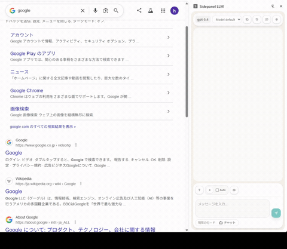

# Sidepanel LLM 2

Chrome のサイドパネルで使う OpenAI ベースのチャット拡張です。  
閲覧中のページを文脈として添付しながら、そのまま横で質問できます。必要に応じて簡易的なブラウザ自動操作も実行できます。


自動操作モードの例:


まだ実験的な挙動を含みます。特に自動操作モードは失敗や誤操作の可能性があります。


右クリック + Alt でドラッグすると、その部分の画像を添付できます。




## 利用者向け

### できること

- Chrome のサイドパネルで OpenAI モデルと会話できます。
- 選択テキストを添付できます。
- 現在のページ本文を添付できます。
- ローカル画像ファイルをドラッグ&ドロップで添付できます。
- 表示中タブのスクリーンショットを添付できます。
- `Alt` + 右ドラッグで範囲スクリーンショットを添付できます。
- 会話セッションを複数保存できます。
- スレッド内容を JSON としてクリップボードにコピーできます。
- 自動操作モードの初回送信時に、現在ページの構造情報を自動添付できます。
- 自動操作モードで、ページの要素確認、クリック、入力、スクロール、キー入力、待機、スクリーンショット取得を段階的に実行できます。

### 必要なもの

- OpenAI API Key
- 開発者モードを有効にした Chrome

### 使い始め方

1. リポジトリを clone して `pnpm install` を実行します。
2. `pnpm build` を実行します。
3. Chrome の `chrome://extensions` を開き、開発者モードを有効にします。
4. `dist` を「パッケージ化されていない拡張機能を読み込む」で読み込みます。
5. 拡張機能アイコンからサイドパネルを開きます。
6. 初回は Options ページで API Key を設定します。
7. 必要に応じて選択テキスト、ページ本文、スクリーンショットを添付して送信します。

### 画面の説明


- 上部にモデル名と reasoning effort の切り替えがあります。
- ヘッダーからスレッドデータのコピー、セッション一覧、新規チャット、設定画面の起動ができます。
- 下部の入力エリアで、選択テキスト、ページ本文、スクリーンショットを添付できます。
- `Auto` を有効にすると、最初の送信時に現在ページ本文を自動添付します。
- モード表示を押すと、通常チャットと自動操作モードを切り替えられます。


### 制約と注意

- 文脈取得や自動操作は、基本的に通常の `http://` / `https://` ページでのみ動作します。
- Chrome の内部ページや拡張機能ページでは、添付取得や自動操作が失敗することがあります。
- 自動操作モードは段階実行型ですが、必ず成功するわけではありません。
- API Key や会話履歴は `chrome.storage.local` に保存されます。
- 一時的な選択状態や範囲キャプチャの受け渡しには `chrome.storage.session` も使用します。

### 保存されるもの

- API Key
- 各種設定
- セッション一覧
- メッセージ履歴
- 添付したページ文脈
- 添付したスクリーンショット

## 開発者向け

### 技術スタック

- React 19
- TypeScript
- Vite
- `@crxjs/vite-plugin`
- Chrome Extension Manifest V3
- OpenAI JavaScript SDK
- Vitest
- Playwright
- Tailwind CSS 4

### セットアップ

```bash
pnpm install
pnpm build
```

ビルド後、Chrome の拡張機能ページで `dist` を読み込みます。

日常的に使うコマンド:

```bash
pnpm dev
pnpm typecheck
pnpm test:unit
pnpm build
pnpm test:e2e
pnpm test:e2e:headed
pnpm test:e2e:headless
```

### テスト構成

- `tests/unit`: 純粋ロジック
- `tests/integration`: Chrome API をモックした統合テスト
- `tests/ui`: DOM / component テスト
- `tests/e2e`: 実拡張フローの Playwright テスト
- `tests/helpers`: 共有テストヘルパー
- `tests/setup`: 共通セットアップ

### ディレクトリ構成

```text
src/
  background/   # service worker と Chrome API 連携
  content/      # ページ上の情報取得と自動操作フック
  lib/          # storage / provider / i18n など共有実装
  options/      # 設定画面
  shared/       # 型と runtime message 契約
  sidepanel/    # サイドパネル UI
tests/
  e2e/
  helpers/
  integration/
  setup/
  ui/
  unit/
```

### 構成ルール

- 共有ドメイン型は `src/shared/models.ts` に置きます。
- runtime message の schema と request / response 型は `src/shared/messages.ts` に置きます。
- 直接の runtime / storage / provider アクセスは `src/lib` か surface-local な `lib` に寄せます。
- `sidepanel/components` は表示、`sidepanel/hooks` は stateful orchestration、`sidepanel/utils` は pure helper に限定します。

### 開発用設定

開発中のみ、`VITE_DEV_OPENAI_API_KEY` を使って API Key の初期値を入れられます。

```bash
cp .env.example .env.local
```

`.env.local` に例えば以下を設定します。

```bash
VITE_DEV_OPENAI_API_KEY=sk-...
```

### 現在の前提

- 接続先は OpenAI Responses API です。
- デフォルトモデルは `gpt-5.4` です。
- Web search は設定で有効 / 無効を切り替えられます。
- 設定と会話履歴はローカル保存です。
