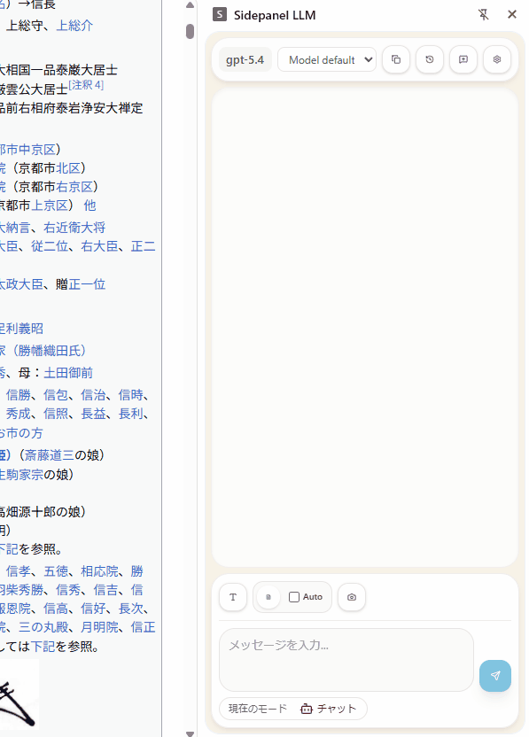
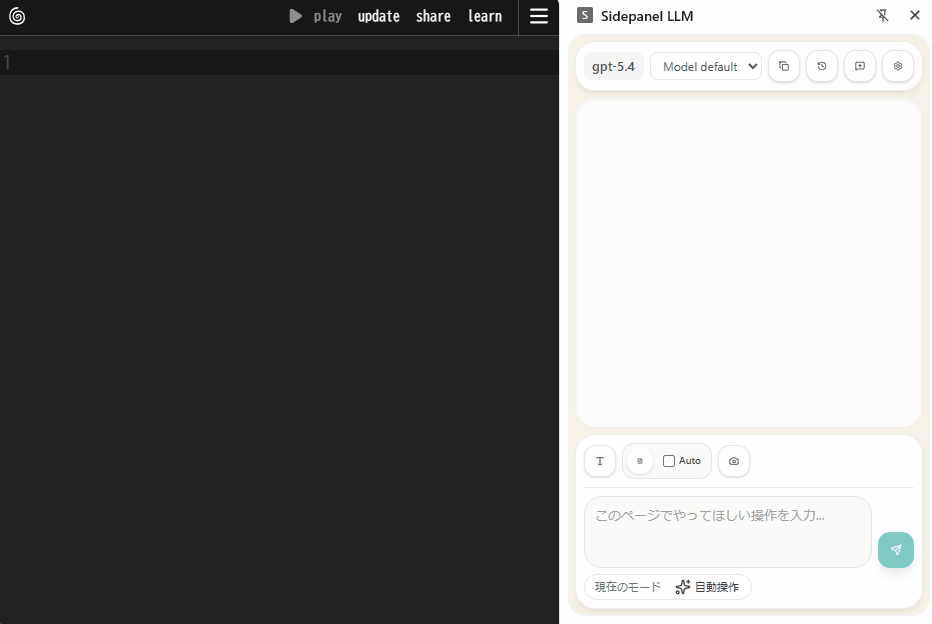

# Sidepanel LLM 2

Chrome のサイドパネルで使う OpenAI ベースのチャット拡張です。  
閲覧中のページを文脈として添付しながら、そのまま横で質問できます。



自動操作モード


## 利用者向け

### できること

- Chrome のサイドパネルでAIと会話できます。
- ドラッグ選択したテキストを添付。
- 現在のページ本文全体を添付。
- 表示中タブのスクリーンショットを添付。
- Alt + 右クリックでドラッグした部分のスクリーンショットを添付。
- 簡易的なブラウザ操作を行う自動操作モード
- 会話セッションを複数保存可能。

### 必要なもの

- OpenAI API Key

### 使い始め方

0. git cloneして`pnpm build`
1. Chrome の拡張機能ページで `dist` を「パッケージ化されていない拡張機能」として読み込みます。
2. 拡張機能からサイドパネルを開きます。
3. 初めの起動では、`Settings` ページで API Key を設定する必要があります。
4. 必要に応じて、選択テキスト、ページ全文、スクリーンショットを添付します。
5. メッセージを送信します。

### 画面の説明


- 会話、添付、セッション切り替えを行う画面
- 右上の設定ボタンからOptionsページを開けます。
- モード表示のラベルをクリックすると、自動操作モードに変わります。

### 保存されるもの

- API Key
- 設定
- セッション一覧
- メッセージ履歴
- 添付したページ文脈

これらは `chrome.storage.local` に保存され、そのブラウザープロファイル内に残ります。

## 開発者向け

### 技術スタック

- React
- TypeScript
- Vite
- `@crxjs/vite-plugin`
- Chrome Extension Manifest V3
- Vitest
- Playwright

### セットアップ

```bash
pnpm install
pnpm build
```

ビルド後、Chrome の拡張機能ページで `dist` を読み込みます。

開発中は必要に応じて以下を使います。

```bash
pnpm dev
pnpm typecheck
pnpm test:unit
pnpm build
pnpm test:e2e
```

### テスト方針

- `tests/unit`: 純粋ロジック
- `tests/integration`: Chrome API をモックした統合テスト
- `tests/ui`: DOM / component テスト
- `tests/e2e`: 実拡張フローの Playwright テスト

### ディレクトリ構成

```text
src/
  background/   # service worker と Chrome API 連携
  content/      # ページ上の情報取得
  lib/          # storage / provider / i18n など共有実装
  options/      # 設定画面
  shared/       # 型と runtime message 契約
  sidepanel/    # サイドパネル UI
tests/
  e2e/
  helpers/
  integration/
  setup/
  ui/
  unit/
```

### 構成ルール

- 共有ドメイン型は `src/shared/models.ts` に置きます。
- runtime message の schema と request/response 型は `src/shared/messages.ts` に置きます。
- 直接の runtime/storage/provider アクセスは `src/lib` か surface-local な `lib` に寄せます。
- `sidepanel/components` は表示、`sidepanel/hooks` は stateful orchestration、`sidepanel/utils` は pure helper に限定します。

### 開発用設定

- 開発時のみ `VITE_DEV_OPENAI_API_KEY` を使って API Key の初期値を入れられます。

`.env.local` の例:

```bash
cp .env.example .env.local
```

### 現在の前提

- 接続先は OpenAI API です。
- 設定と会話履歴はローカル保存です。
